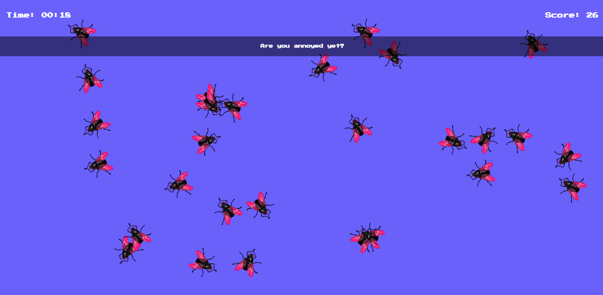

# 🎮 Catch The Insect

Welcome to **Catch The Insect** — an addictive and fun web game where your mission is simple: **catch the insects** before they take over the screen! 🦟🪳🕷️  
Challenge your reflexes and see how long you can survive! ⏳

---

## ✨ Features

- 🎯 **Select Your Favorite Insect** — Choose between flies, mosquitoes, spiders, and roaches.
- 🕒 **Timer** — Track how long you last!
- 🏆 **Scoring System** — Catch more insects to boost your score.
- 💣 **Increasing Difficulty** — More insects appear the longer you play.
- 🎨 **Retro Pixel Style** — Built with a classic arcade theme!

---

## 🖼️ Demo

### 📸 Screenshot📍




---

## 📁 Project Structure

```
INSECT CATCH GAME/
├── demo.png
├── index.html
├── README.MD
├── script.js
└── style.css

```

---

## 🤝 Credits

Built with ❤️ using **HTML**, **CSS**, and **JavaScript**.  

---

## 🙏 Thank You!

Thanks a ton for checking out **Catch The Insect**!  
I hope you had fun exploring it as much as I had fun building it. 😊  
If you enjoyed it, feel free to ⭐ star the repo and share it!
